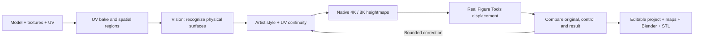

# Sculptor’s Hoard

**Turn painted character textures into editable 3D relief.**

A local AI workspace for preparing heightmaps for Blender Figure Tools. Sculptor’s Hoard connects what a surface *means* on a 3D model to how it should displace: an eyelid, a pupil, a buckle and a painted shadow need different treatment.

The project grew from a practical problem: repeatedly recoloring large character textures by hand before preparing figures for printing.



## What it does

- **Semantic preparation.** A vision model observes the complete figure before mapping its parts to numbered UV regions and their projected 3D locations. A validated scene description separates observed geometry from the artist's height policy. Hidden features can request another camera view and a matched close-up; saved per-part evidence is available in the editor. Distinctive details accidentally grouped with a broad surface receive a focused check.
- **Actual 3D feedback.** Blender runs the installed Figure Tools nodes. The reviewer compares the displaced result with a uniform-height control, including facial close-ups. Complete figures are reviewed after body and clothing are assembled.
- **Large textures.** Native-resolution RGBA PNG output with 16-bit heights, bounded-memory row processing, spatial color disambiguation, UV padding and a content cache. Identical black pupils and nostrils can remain independently editable.
- **Useful editing.** Natural-language adjustments, linked heights, group merging and splitting, relief contrast, autosave, named versions, undo and redo.
- **Local production.** Persistent figure queues, phase recovery, model selection/download/load/unload, and observed GPU memory, utilization and temperature.
- **Reproducible evidence.** Each evaluation retains model inputs and responses, masks, plans, native maps, render settings, geometry measurements and saved Blender scenes.

## Run locally

The tested production environment is **Windows, Python 3.12/3.13, Node.js, Blender 5.0 with Figure Tools, and Ollama**. Figure Tools is an external dependency; its code and assets are not included.

```powershell
python -m venv .venv
.venv\Scripts\python -m pip install -r requirements.txt
npm ci
npm run build
.venv\Scripts\python start.py
```

After installation, use **Abrir Sculptors Hoard.cmd**. The application opens at `http://127.0.0.1:8766`. Set `SCULPTORS_HOARD_BLENDER` if Blender is installed elsewhere.

1. In **Equipo y lotes**, choose an installed vision model and check its real memory state.
2. Scan a folder of `.blend` scenes, select figures and enqueue a preparation. The current complete-figure recipe separates clothing named `mTops`; other material selections are available in the single-figure workflow.
3. Open the saved result and compare the original, uniform control and displaced figure. Review the face, clothing and back.
4. Adjust a group or write an instruction such as *“los ojos más hundidos”* or *“las pecas con más relieve”*. **Comprobar mis cambios** evaluates explicit edits without automatically replacing them.
5. Export native maps, the editable Blender scene or the final STL. Final artifacts must correspond to the current project revision.

Install `blender/relief_bridge.py` as a Blender add-on to send a scene and import exported maps. When manually refreshing Figure Tools textures, the demonstrated workflow remains **Auto Reload → confirm Subdivision → leave the field**. The background worker reloads images and forces reevaluation automatically.

## Height policy

The initial eye order follows the artist's preference:

**sclera < iris < pupil < skin < eyelid < eyebrow/eyelash**

An iris is not invented when the artwork does not distinguish it. These are local displacements on existing geometry, not absolute 3D positions. Explicit edits take precedence. In the native Figure Tools profile, **128 is a reference height, not zero displacement**.

## Evaluation and limits

The repository contains deterministic tests for spatial masks, native output, UV padding, band boundaries, continuity, commands, revision conflicts, history recovery and queue checkpoints. Run:

```powershell
python -m pytest -q
npm run build
```

Real Blender/VLM trials are kept separately from these tests. `scripts/benchmark_first_pass.py` runs fresh complete-figure evaluations without previous semantic decisions. `scripts/score_first_pass.py` compares an output with a separately curated reference at feature level, so correct skin cannot hide a missing eyelash. Private character assets and generated working data are excluded from Git.

A checked 8192² RGBA/16-bit body map exported in **20.28 seconds**; four maps up to 8K took **31.02 seconds** with UV padding, without cache, on the development machine. These timings measure export, not full AI generation. See [evaluation notes](docs/EVALUATION.md) for the hardware, failed trials and practical limits.

Vision models still make semantic mistakes, and their own approval can be wrong. A closed mesh alone does not prove that thin clothing survived or that a figure is ready to print. Outputs remain reviewable proposals. This project does not claim universal five-minute preparation, calibrated confidence or a model trained from scratch.

## Engineering

React, TypeScript and Three.js for the workspace; FastAPI, NumPy, SciPy and scikit-learn for processing; Ollama for local vision/language; Blender as the geometry evaluation engine; SQLite WAL for history and production queues.

- [Architecture and design decisions](docs/ARCHITECTURE.md)
- [Figure Tools integration](docs/FIGURE_TOOLS.md)
- [Evaluation evidence and limitations](docs/EVALUATION.md)
- [Portfolio case study](docs/PORTFOLIO.md)

Code is available under the [MIT license](LICENSE). Third-party models, add-ons and input assets retain their own licenses.

### Compatibility with earlier names

Existing saved projects and browser preferences remain available. The Blender bridge reads both `sculptors-hoard-project.json` and legacy `relief-project.json` exports. `RELIEF_BLENDER` and `RELIEF_DATA_DIR` remain supported as fallbacks for `SCULPTORS_HOARD_BLENDER` and `SCULPTORS_HOARD_DATA_DIR`. The internal `relief.*` Blender operator identifiers are retained for existing integrations.
